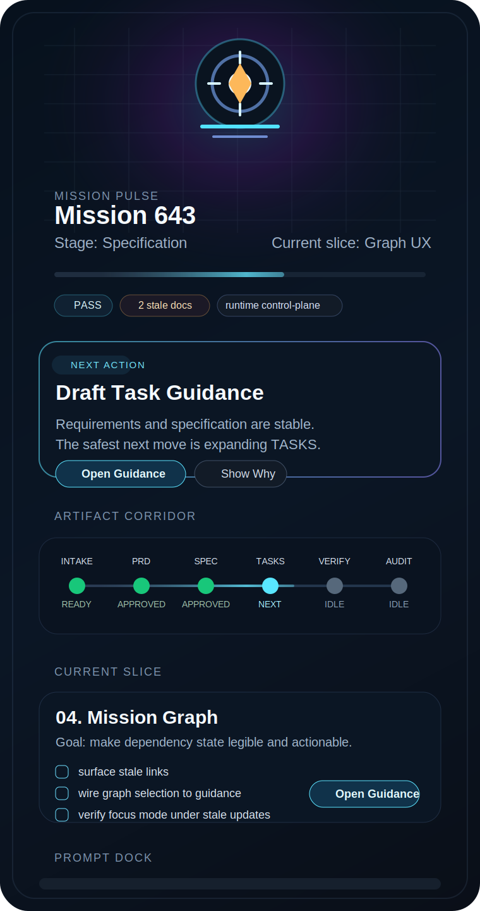
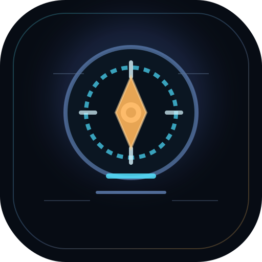

<!--
	@file apps/vscode-extension/docs/cockpit-sidebar-ux-spec.md
   @description Defines the Mission flight controller cockpit UX for the VS Code left pane, including information architecture, visual language, and rollout guidance.
-->
# Mission Flight Controller Cockpit UX Spec

## Intent

Mission should feel like the runtime cockpit for the repository control-plane, not a document browser and not a raw command palette.

This spec now treats the latest `Mission Control Cockpit` layout exploration as the structural baseline and explicitly rejects further broad generative redesign. The next step is to implement the layout simply, prove its interaction model, and refine visual style only after the structure is correct.

The flight controller should be able to answer these questions in under two seconds:

1. What state is this mission in?
2. What is the exact next bounded action?
3. What changed or became stale?
4. Am I safe to proceed?

## Product Positioning

- `Runtime` is the repository-local control-plane that executes Mission work.
- `Mission` is the flight-controller-facing cockpit that makes that control-plane legible and operable.
- The left pane is the `decision surface`, not the full exploration surface.
- The roadmap, graph, and deep console remain editor-level surfaces.

## Terminology

Use these terms consistently:

1. `Runtime`
   - the repository-local execution layer behind Mission
   - never the human flight controller inside Mission copy
2. `Cockpit`
   - the Mission flight-deck surface in VS Code
   - the place where actions are surfaced
   - never the human flight controller
3. `Flight`
   - the flight-controller-facing name for one bounded execution unit in the cockpit, roadmap, and graph
   - maps to the canonical workflow `slice` term in code and mission artifacts
   - never means a stage or an individual task
4. `Flight Controller`
   - the formal human role in Mission UI and UX copy
   - the actor who reviews, confirms, intervenes, and responds to prompts
5. `Contributor`
   - a plain-language documentation fallback when air-mission language would be distracting
   - never the primary role label in cockpit UI or primary UX terminology

Rule:

- do not use `Runtime` to mean the person in Mission UI or UX documentation
- do not use `Cockpit` to mean the person
- do not use `Flight` to mean a stage or a task
- prefer `Flight Controller` in formal UI, state, and UX copy
- use `Contributor` only as a plain-language fallback in broader product or documentation prose
- prefer `Flight` in cockpit-facing UX copy while keeping `slice` as the internal implementation term
- current implementation compatibility terms such as `operatorState` or `Operator input is required` are transitional and should not define the target UX vocabulary

## Brand Direction

Mission should look like a calm, precise flight deck with a restrained, neutral instrument identity:

- No generic sci-fi chrome.
- No dashboard clutter.
- Use an abstract instrument signature, not a mascot or brand mark.
- Favor dials, rails, shield contours, and flight-deck geometry over illustrative character forms.
- No dependence on inherited mascot or legacy concept-art branding.

The reference concept art is not just a mood board. It is the structural reference for the cockpit's vertical rhythm and major zones.

That means the product cockpit should preserve these compositional ideas even after simplification:

1. a `Mission Pulse` header band
2. a dominant `Next Action` deck near the top
3. an `Artifact Corridor` that reads as a horizontal progress spine
4. a clearly bounded `Current Flight` work card
5. a low-positioned `Prompt Dock`

The design should be built as a premium product surface with restrained materials and typography, not as a concept illustration that happens to contain UI.

Reference concept art:



Reusable crest:



## Experience Principles

### 1. Action Semantics Before Content

The cockpit must answer three questions before it asks the flight controller to read any flight detail:

1. Where am I in the workflow?
2. Why am I stopped or ready?
3. What exact actions are legal right now?

### 2. Two Flight Controller Action Families

The cockpit must explicitly distinguish:

1. `Human checkpoint` actions
   - the workflow has reached a review or confirmation point
   - examples: `Approve Tasks`, `Approve Verification`, `Reply to Prompt`
2. `Manual intervention` actions
   - the flight controller is deviating from the default forward path
   - examples: `Revisit Previous Flight`, `Reopen Task`

The UI must never style these as the same kind of action.

### 3. Normal Flow Must Be Literal

Generic verbs like `Proceed` or `Continue` are allowed only if they describe the exact effect.

Preferred labels:

1. `Open Guidance`
2. `Approve <Artifact>`
3. `Revisit Previous Flight`
4. `Mark Done`
5. `Reopen`

### 4. Progressive Disclosure For Flight Meaning

Flight and task text is too dense to be the first-line navigation surface.

Default flight view must show:

1. flight title
2. flight status
3. next task
4. stop condition

Expanded flight context may show:

1. outcome
2. verification targets
3. required skills

### 5. Gates Must Be Legible In Place

The flight controller must see the real blocker or gate reason inline in the cockpit itself.

The cockpit should not require the flight controller to infer gate state from color alone or to switch to another surface to understand why normal flow is blocked.

### 6. Instrumentation Must Encode Real Truth

Gauges are allowed because they encode repository truth.

1. left gauge = stage state
2. right gauge = flight state
3. gauge segments may open related artifacts

No decorative cockpit element should survive if it does not carry state, action, or context.

## Information Architecture

The left pane remains a dedicated cockpit webview with the existing tree retained as a secondary `Mission Explorer` surface.

The current implementation direction got the semantic hierarchy mostly right, but it flattened the visual structure too far.

This spec restores the intended composition:

1. `Mission Pulse` gives fast mission state and atmospheric identity
2. `Next Action Deck` is the primary semantic and action surface
3. `Artifact Corridor` keeps mission documents legible as a governed spine
4. `Dual Gauges` remain supporting instruments, not the hero region
5. `Current Flight Card` is the active bounded execution surface
6. `Prompt Dock` sits lower as a checkpoint/intervention console

### Concrete Container Layout

1. cockpit webview
2. `Mission Explorer` tree view

### Concrete Cockpit Zones

#### Zone A: Mission Pulse Header

Persistent identity and mission pulse band.

Contents:

1. mission id
2. mission title
3. active stage badge
4. active flight or mission-focus line
5. pulse rail or progress spine accent
6. flight controller mode badge
7. compact stale or gate chips when relevant

Flight controller mode badge values:

1. `Normal flow`
2. `Human checkpoint`
3. `Manual intervention`
4. `Gate blocked`
5. `Standby`

Rules:

1. this zone should visually echo the concept-art `Mission Pulse` strip rather than a plain generic card stack
2. it should establish state before the cockpit asks for detailed reading

#### Zone B: Next Action Deck

This is the first decision surface and the top semantic priority.

It should recover the concept-art `Next Action` emphasis while keeping the newer flight-controller-state semantics.

Contents:

1. flight controller headline
2. flight controller detail line
3. primary next-action title
4. primary CTA
5. secondary explanation action when useful
6. gate summary badge
7. next task chip when available
8. stop condition chip when available
9. blocking rules list when blocked
10. grouped checkpoint and intervention actions below the dominant CTA when needed

Headline examples:

1. `Normal flow is ready`
2. `A human checkpoint is next`
3. `Flight Controller input is required`
4. `The workflow is blocked`
5. `Only intervention actions remain`

Rules:

1. this deck must be above the artifact corridor and gauges
2. this deck must state why the flight controller is seeing the current action surface
3. if blockers exist, the first blocker becomes the detail line and the full list is shown below
4. the dominant action must read like the concept-art `Next Action` panel, not like one action group among several equal cards
5. checkpoint and intervention actions remain visible, but subordinate to the dominant next move

#### Zone C: Artifact Corridor

This zone restores the concept-art horizontal mission spine.

It is not optional chrome. It is the flight controller's quick-read artifact sequence.

Contents:

1. ordered mission artifacts from intake through audit
2. current focus highlight
3. readiness or disposition state per artifact
4. stale indicators where applicable
5. preview or preparation affordances where applicable

Rules:

1. this corridor should read as a governed sequence, not as unrelated pills
2. it should sit above the gauges, matching the concept-art pacing
3. the active artifact should be obvious without opening another surface
4. the corridor should make stage-to-document alignment visible in one glance

#### Zone D: Action Bands

The cockpit still groups actions into explicit semantic bands, but they now live under the Next Action Deck rather than replacing it as the whole structure.

The grouped actions remain:

##### Group 1: `Normal Flow`

Use for the safest governed next step.

Examples:

1. `Open Guidance`
2. `Approve Tasks`
3. `Approve Verification`
4. `Intermediate Commit`

##### Group 2: `Human Checkpoints`

Use for review or confirmation actions that are still part of the normal mission contract.

Examples:

1. approving an artifact that is ready
2. replying to an explicit flight controller prompt

##### Group 3: `Manual Intervention`

Use for deliberate deviation from the forward path.

Examples:

1. `Revisit Previous Flight`
2. task reopening actions at flight level

Rules:

1. intervention actions must have warning styling, never the same styling as normal flow
2. `Normal Flow` may contain only one dominant action at a time
3. `Human Checkpoints` and `Manual Intervention` are secondary to `Normal Flow`

#### Zone E: Dual Gauge Row

Contents:

1. stage gauge
2. flight gauge
3. combined stage and flight summary badge

Rules:

1. the gauges remain overview instruments, not the main action surface
2. stage gauge segments may open related artifacts in preview
3. the gauges must stay visually calmer than the Next Action Deck and Artifact Corridor above them
4. this row should feel like supporting instrumentation beneath the corridor, consistent with the concept art

#### Zone F: Current Flight Card

Single active flight card only. No horizontal flight rail.

Default visible contents:

1. flight sequence
2. flight title
3. flight status badge
4. next task chip
5. stop condition chip
6. task list with explicit task actions
7. `Open Guidance` button

Expandable section:

1. outcome
2. verification targets
3. required skills

Task rules:

1. task rows are not toggle surfaces
2. incomplete active tasks may show `Mark Done`
3. completed tasks may show `Reopen`
4. task labels must clamp before the UI shrinks typography further
5. this card should read like the concept-art `Current Flight` work region, not like a generic backlog card

#### Zone G: Prompt Dock

Collapsible flight controller prompt surface.

Contents:

1. prompt activity state
2. prompt transcript lines
3. quick reply buttons
4. text input
5. send action

Rules:

1. if input is awaited, this dock becomes part of the human checkpoint path
2. it may expand automatically when the workflow pauses on a prompt
3. it must not displace the Mission Pulse, Next Action Deck, or Artifact Corridor
4. default placement should stay low in the stack, matching the concept-art footer-console feeling

#### Zone H: Utilities

Low-emphasis secondary tools.

Actions:

1. `Refresh`
2. `Roadmap`
3. `Chat`
4. `Folder`
5. `Gate`

## Visual Language

### Mood

- Precision over spectacle
- Atmospheric over flat
- Technical over ornamental
- Warmly futuristic over cyberpunk
- Product-grade over concept-art

### Color System

Base should continue respecting VS Code theme tokens, but the cockpit may layer restrained accents.

Primary accents:

- Flight cyan: active guidance, active gauge segment, active pointer emphasis
- Signal amber: review, stale, caution
- Mission green: approved, safe, complete
- Muted mission red: blocked, rejected, unsafe
- Accent violet: remove from primary status use; allow only as a rare atmospheric accent if needed

Use violet as a restrained accent, not as the primary status color.

Default surface palette:

1. dark navy
2. graphite
3. smoked blue-black
4. muted steel
5. off-white text

### Surfaces

- soft instrument panels
- inset rails
- thin borders
- subtle gradients
- restrained mechanical seams

Avoid:

- glossy cards
- thick shadows
- heavy bevels
- neon everywhere
- toy-like control styling
- hollow empty canvases used as fake elegance

### Typography

Use the existing VS Code font stack for operational text, but create hierarchy through spacing and casing:

- compact uppercase labels for system sections
- strong sentence-case action titles
- tabular numeric alignment for counts and progress
- clearer size separation between labels, titles, and secondary metadata
- avoid faint micro-type that collapses the hierarchy

### Motion

Motion should be sparse and semantic:

1. pulse for active run state
2. sweep or shimmer for prompt awaiting input
3. smooth progress transitions
4. subtle expand/collapse for contextual sections

Do not animate static chrome.

## Dynamic Gauge Rendering Strategy

The cockpit gauges should be implemented as custom SVG components in Svelte.

Do not use:

1. generic charting libraries
2. canvas-based rendering
3. CSS-only conic-gradient gauges as the primary implementation

Reasons:

1. custom SVG provides precise control over segment geometry
2. custom SVG supports crisp pointers, hubs, and labels
3. custom SVG keeps the gauge visually custom rather than chart-library generic
4. custom SVG is easier to theme with CSS variables and design tokens

### Recommended Gauge Architecture

1. `Gauge.svelte`
   - generic gauge renderer
   - accepts segment model, pointer index, size, and labels
2. `StageGauge.svelte`
   - maps mission stages onto the generic renderer
3. `FlightGauge.svelte`
   - maps flights onto the generic renderer

### Gauge Visual Layers

1. outer bezel
2. muted background track
3. segmented arc paths
4. active pointer hand
5. center hub
6. optional subtle tick marks
7. restrained labels

### Gauge Styling Tokens

Define tokens for:

1. track color
2. neutral segment color
3. active segment color
4. complete segment color
5. warning segment color
6. blocked segment color
7. pointer color
8. hub color
9. label color

### Gauge Motion

Allow only:

1. pointer rotation transition
2. subtle active segment emphasis
3. smooth state interpolation

Do not add decorative pulse loops, scanning rings, or non-semantic motion.

## Graphics System

### Core Motifs

1. `Twin dials`
   - subtle paired-circle reference for instrumentation
   - used sparingly in gauge hubs or header details

2. `Shield envelope`
   - soft lower contour or guard shape
   - used behind the main instrument mark only when helpful

3. `Flight rails`
   - thin horizontal guides connecting flight regions, corridor elements, or lower controls

### Graphics Usage Rules

- One hero graphic at the top of the cockpit is enough.
- Decorative graphics should sit behind content, never between user and action.
- Status graphics must remain token-driven so dark/light themes stay coherent.
- If the layout works without a decorative graphic, prefer removing it.

## Suggested Sidebar Wireframe

```text
┌──────────────────────────────────────┐
│ Mission Pulse                        │
│ Mission 643      Stage: SPEC         │
│ Graph UX         Mode: NORMAL FLOW   │
│ Active flight: Graph UX              │
│ [PASS] [2 stale docs] [runtime module] │
├──────────────────────────────────────┤
│ Next Action Deck                     │
│ Draft Task Guidance                  │
│ Requirements and specification stable│
│ [Open Guidance] [Show Why]           │
│ [Checkpoint] Approve Tasks           │
│ [Intervention] Revisit Previous      │
├──────────────────────────────────────┤
│ Artifact Corridor                    │
│ INTAKE PRD SPEC TASKS VERIFY AUDIT   │
│ ready approved approved next idle    │
├──────────────────────────────────────┤
│ Stage Gauge        Flight Gauge      │
│   pointer -> SPEC    pointer -> 04   │
├──────────────────────────────────────┤
│ Current Flight                       │
│ Flight 04  Active                    │
│ Next: task one  Stop: verify target  │
│ [Mark Done] [Open Guidance]          │
├──────────────────────────────────────┤
│ Prompt Dock                          │
│ Flight Controller waiting to confirm │
│ [Yes] [No] [Refine]                  │
├──────────────────────────────────────┤
│ Utilities / secondary actions        │
└──────────────────────────────────────┘
```

## Interaction Model

### Default State

1. mission pulse header visible
2. next action deck visible
3. artifact corridor visible
4. dual gauges visible
5. single current flight card visible
6. prompt dock collapsed when idle
7. utilities compact

### When Normal Flow Is Available

1. flight controller mode = `Normal flow`
2. the dominant action appears in the `Normal Flow` group
3. the label must describe the exact effect, usually `Open Guidance`

### When A Human Checkpoint Is Required

1. flight controller mode = `Human checkpoint`
2. checkpoint actions appear in their own group
3. prompt dock expands automatically if a live reply is required

### When The Workflow Is Blocked

1. flight controller mode = `Gate blocked`
2. blocker text is shown inline in the next action deck
3. the cockpit must not present a generic forward action that looks safe

### When Only Manual Intervention Remains

1. flight controller mode = `Manual intervention`
2. intervention actions appear in warning styling
3. these actions are available but clearly framed as deviation from the normal path

## Implementation Direction

### Phase 1: Structural Reconciliation

Deliverables:

1. restore the concept-art vertical rhythm in production UI
2. reintroduce a true next-action deck above grouped actions
3. render the artifact corridor from existing cockpit artifact data
4. keep the current gate-first semantics while restoring the stronger composition

### Phase 2: Flight-Controller State Foundation

Deliverables:

1. flight-controller state deck content inside the next-action region
2. grouped action bands under the dominant next action
3. dual SVG gauges
4. single current flight card with progressive disclosure
5. prompt dock
6. utilities rail

### Phase 3: Gate Legibility

Deliverables:

1. inline blocker rendering from gate and mission status truth
2. exact action labels for normal flow vs checkpoint vs intervention
3. artifact preview links from gauge segments

### Phase 4: Styling Refinement

Refine materials, spacing, and motion after the action hierarchy is proven.

### Phase 5: Mission Explorer Simplification

Keep the tree as a deep inspection surface, not the default continuation surface.

## Data Contract Additions

The cockpit should receive a purpose-built summary model rather than reconstructing the experience from raw tree nodes.

Required model fields:

1. `flightControllerState`
   - current implementation compatibility name may still be `operatorState`
   - `headline`
   - `detail`
   - `modeLabel`
   - `stateTone`
   - `blockers[]`
   - `nextTaskLabel?`
   - `stopCondition?`
2. `actionGroups[]`
   - `normal-flow`
   - `checkpoint`
   - `intervention`
3. `stageGauge`
4. `flightGauge`
   - current implementation compatibility name may still be `sliceGauge`
5. `artifacts[]`
   - drives the Artifact Corridor
6. `currentFlight`
   - current implementation compatibility may still derive this from `sliceRail[]` or `currentSliceCard`
7. `promptDock`
8. `utilities[]`
9. `gateSummary`

Transitional compatibility note:

- internal implementation names such as `sliceGauge`, `sliceRail`, and `currentSliceCard` are tolerated only as code-level compatibility details
- flight-controller-facing UX language, specs, and future public summary models should use `flight` terminology consistently
- future public summary models should prefer `flightControllerState` over `operatorState`

## Acceptance Criteria

The cockpit redesign succeeds when:

1. a flight controller can identify the active stage, flight controller mode, and exact next legal action in under two seconds
2. a blocked workflow explains why it is blocked without opening another surface
3. a human checkpoint is visibly distinct from a manual intervention
4. task rows do not look or behave like generic toggles
5. long flight and task text does not dominate the initial reading path
6. the tree view remains optional for normal workflow continuation

## Non-Goals

1. Do not turn the sidebar into a full DAG canvas
2. Do not duplicate the entire roadmap editor experience in the left pane
3. Do not bury the main action behind tabs
4. Do not overload the cockpit with raw mission YAML or verbose logs
5. Do not flatten the cockpit into generic dark cards like `Mission Control Cockpit V2`
6. Do not reintroduce mascot-led hero art or ornamental gauge clutter

## Recommendation

Keep the current semantic direction, but do not keep the current flattened structure as the final cockpit form. The correct next iteration path is:

1. restore the concept-art structural stack: Mission Pulse, Next Action Deck, Artifact Corridor, Current Flight, Prompt Dock
2. keep the gate-first flight-controller semantics inside that stronger structure
3. render the existing artifact data as a real corridor instead of hiding it from the cockpit
4. tighten checkpoint versus intervention styling inside the new next-action region
5. refine the current flight card so task meaning stays legible without expanding too much text
