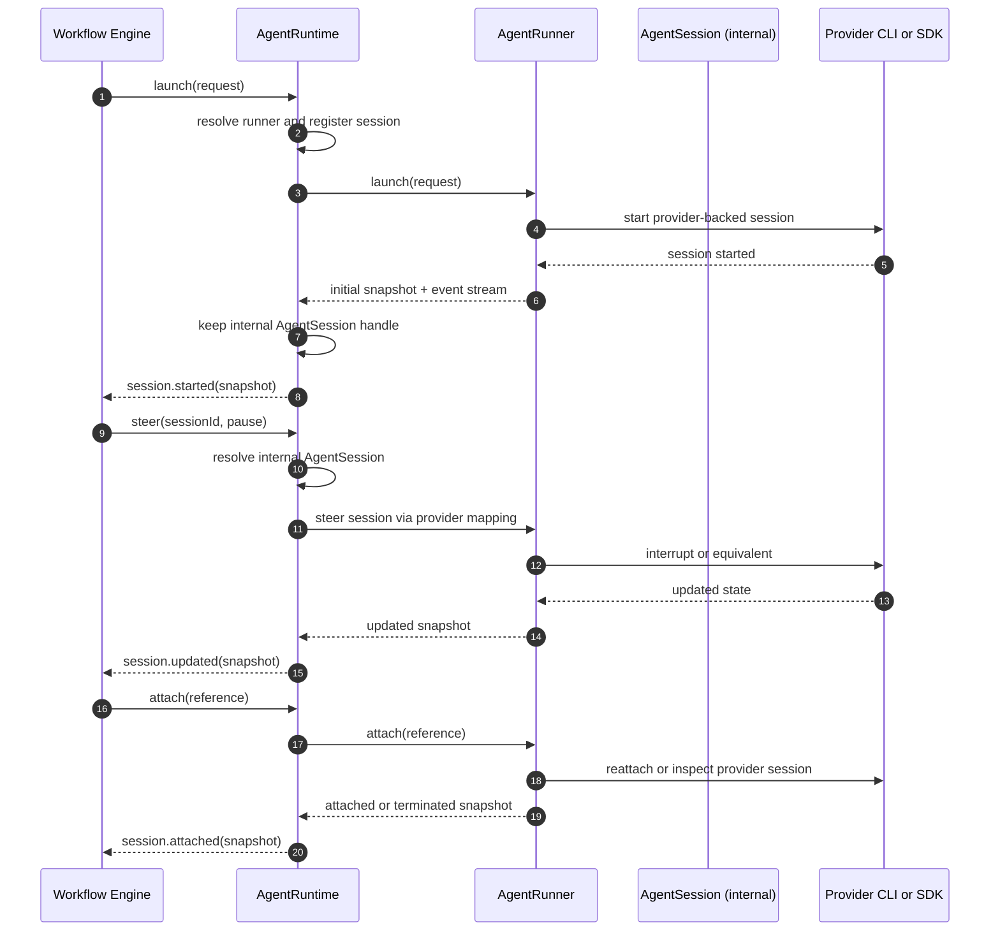

# Agent Runtime

The agent runtime is the provider-neutral execution layer that satisfies workflow session requests.

It is separate from the workflow engine and from Airport or Runway surface concerns for a specific reason: each layer owns a different kind of truth.

- The workflow engine owns mission semantics: what task should run, when a task should start, when it should pause, when it should resume, and what completion means.
- The agent runtime owns execution semantics: how a live agent session is launched, attached, observed, steered, cancelled, terminated, and recovered.
- Airport and Runway surfaces own presentation semantics: how sessions are displayed, routed to panes, projected into layout state, and exposed to operators.

This separation prevents three kinds of architectural leakage:

1. workflow policy leaking into provider adapters
2. provider and transport mechanics leaking into mission state
3. UI and layout concerns leaking into runtime control contracts

The runtime therefore exists to normalize provider execution into a stable operational boundary without taking ownership of mission policy or surface presentation.

The workflow engine should see one runtime boundary only: `AgentRuntime`.

## Primary Components

| Component | Responsibility | Owned state | Runtime boundary |
| --- | --- | --- | --- |
| `AgentRuntime` | Launch, attach, observe, prompt, steer, cancel, terminate, and recover agent sessions for the workflow engine | live session registry, recovery, event fanout, runner resolution | Daemon/runtime |
| `AgentRunner` | Thin provider adapter contract implemented per backend | provider-specific launch, attach, control, and event emission | Provider-specific |
| `AgentSessionSnapshot` | Normalized session state exposed to the workflow engine and surfaces | no behavior, state only | Shared contract |
| `AgentSessionEvent` | Normalized runtime facts emitted by the runtime | append-only runtime observations | Shared contract |

## File Structure

The target structure has two layers:

### First-Class Public Runtime Contract

These are the files that define the architecture seen by the workflow engine and other callers:

- `AgentRuntime.ts`
- `AgentRunner.ts`
- `AgentRuntimeTypes.ts`

That means the first-class concepts are:

- `AgentRuntime`
- `AgentRunner`
- `AgentSessionSnapshot`
- `AgentSessionEvent`

### Internal Runtime Implementation

These may exist in code, but they are not first-class architecture:

- an in-memory session registry
- a runner event bridge
- a persistence helper
- a terminal transport helper
- an internal `AgentSession` handle type
- an internal orchestration helper such as `AgentSessionOrchestrator`

If an internal helper exists, it is owned by `AgentRuntime`.

It must not become a second public runtime boundary.

## Architectural Boundaries

The runtime architecture separates three concerns:

| Concern | Primary component | Description |
| --- | --- | --- |
| Workflow-facing control plane | `AgentRuntime` | The only live-session service visible to the workflow engine |
| Provider integration | `AgentRunner` | The adapter that translates runtime operations into provider-specific behavior |
| Shared runtime facts | `AgentSessionSnapshot`, `AgentSessionEvent` | The normalized state and event contract used across runtime boundaries |

This separation keeps provider mechanics out of workflow logic and prevents internal execution details from becoming public architecture.

## Ownership Model

| Layer | Owns | Must not own |
| --- | --- | --- |
| Workflow engine | when work should start, be steered, stop, or recover; mission truth | provider protocol, terminal IO details |
| Agent runtime | live session registry, event observation, reconciliation, persistence, and runner resolution | workflow truth, Airport layout semantics |
| Agent runner | provider translation and provider-specific process or SDK interaction | workflow policy, Runway routing |

## Public Model

The public runtime model is defined by four first-class concepts:

- `AgentRuntime`
- `AgentRunner`
- `AgentSessionSnapshot`
- `AgentSessionEvent`

`AgentSession` is not part of the public runtime contract.

The workflow engine interacts with live agent execution only through `AgentRuntime`.
The workflow engine observes runtime state through `AgentSessionSnapshot` and `AgentSessionEvent`.

This means the architecture exposes a service-and-observation model rather than an object-per-session public model.

## Internal Session Model

Runtime implementations may use an internal `AgentSession` handle to represent one live provider-backed session instance.

That internal handle is owned by the runtime implementation and exists to support execution concerns such as:

- holding provider attachment state
- tracking live process or SDK references
- coordinating session-local recovery or cleanup
- associating runner state with normalized runtime snapshots

Whether that internal handle exists as a class, record, or module-local structure is an implementation choice.
It is not a public architecture boundary.

## Instance Model

If `AgentSession` exists, it should mean one live provider-backed session instance.

That makes the internal relationship:

- `AgentRuntime` is the workflow-facing service
- `AgentRunner` is the provider-facing adapter
- `AgentSession` is an internal live-session handle owned by the runtime implementation

In that model:

1. the runtime chooses or resolves the runner
2. the runner launches or reattaches a provider-backed session
3. the runtime holds the live session handle internally
4. the runtime exposes only snapshots and events publicly

### Component Semantics

| Component | Architectural meaning |
| --- | --- |
| `AgentRuntime` | Runtime service responsible for session lifecycle control, observation, recovery, and normalization |
| `AgentRunner` | Provider adapter responsible for provider-specific launch, attach, prompt, steer, and termination behavior |
| `AgentSession` | Optional internal live-session handle representing one running provider-backed instance |
| `AgentSessionOrchestrator` | Optional internal helper used by runtime implementation; not part of the public architectural model |

If a file named `AgentSessionOrchestrator` exists in the codebase, it should be interpreted as implementation detail only. It must not define a separate public boundary or a competing ownership model.

## Runtime Sequence

This diagram shows the intended responsibility split.

The key point is that the workflow engine never talks to `AgentSession` or `AgentRunner` directly.

The workflow engine talks to `AgentRuntime`.

The runtime may use an internal `AgentSession` handle and an internal orchestration helper, but those are implementation details.

## Responsibility Summary

| Component | Must do | Must not do |
| --- | --- | --- |
| `AgentRuntime` | select runners, manage live sessions, normalize observations, expose snapshots and events, own recovery | encode provider-specific command protocols, expose private transport concerns to workflow callers |
| `AgentRunner` | translate runtime operations to one provider backend, emit provider-derived observations, attach to existing provider sessions | own workflow policy, own mission truth, expose provider-native semantics as the core contract |
| `AgentSession` | represent one live runtime-managed session internally if needed | become a workflow-facing boundary |
| `AgentSessionOrchestrator` | coordinate runtime internals if needed | become a top-level architecture concept |

## Lifecycle Contract

The runtime normalizes provider behavior into a consistent session lifecycle.

| Runtime phase | Meaning |
| --- | --- |
| `starting` | Session was requested and is booting |
| `running` | Session is alive and progressing autonomously |
| `paused` | Mission intentionally interrupted the session and expects no autonomous progress |
| `awaiting-input` | Session is alive but waiting for operator or engine input |
| `completed` | Session reached a successful terminal state |
| `failed` | Session ended unsuccessfully |
| `cancelled` | Session was cancelled intentionally |
| `terminated` | Session was force-terminated or could not be reattached |

## Reconciliation Boundary

Recovery after daemon restart is owned by `AgentRuntime`, not by the workflow engine.

Persistence stores, event emitters, and terminal transport helpers may exist, but they are runtime implementation details rather than first-class architecture.

## Contract Rules

1. `AgentLaunchRequest.requestedRunnerId` is advisory. `AgentRuntime` decides which runner actually launches the session.
2. `AgentRunner` must expose an event stream so `AgentRuntime` can construct the authoritative runtime observation stream.
3. `attach(...)` never returns `undefined`; not-found reattachment resolves to a terminal snapshot with status `terminated`.
4. Invalid prompt or steer operations fail through typed runtime errors, not silent no-ops.

## Invariants

1. The workflow engine talks only to `AgentRuntime` for live session work.
2. Runners translate provider protocol; they do not define workflow policy.
3. Session control uses normalized Mission prompts and steering actions, not provider-native slash commands as the core contract.
4. Runtime session state must be reconciled back through workflow events before it becomes mission truth.
5. Terminal integration, persistence, and event plumbing are private runtime concerns unless a specific contract truly needs to be public.

## Adjacent Components

- See [workflow-engine.md](./workflow-engine.html) for how runtime events are ingested into mission state.
- See [contracts.md](./contracts.html) for session-related IPC methods.
- See [airport-control-plane.md](./airport-control-plane.html) for how agent sessions are projected into Runway.
