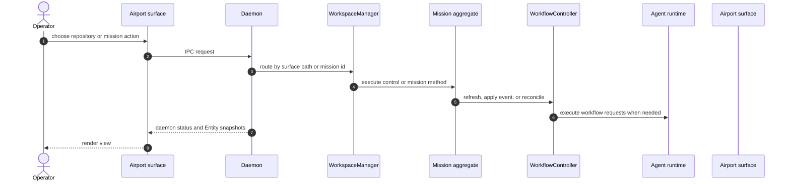

# System Context

Mission is a local-first engineering control system with three distinct runtime planes:

1. The repository plane, where durable Mission control files live under `.mission/`.
2. The daemon plane, where the system composes repository state, mission state, and client connections into live views.
3. The surface plane, where Airport web and native surfaces render daemon views and submit intent.

## Runtime Environments

| Environment | What runs there | What it owns |
| --- | --- | --- |
| Git repository checkout | `.mission/settings.json`, mission dossiers, tracked artifacts | Repository-scoped control state and mission history |
| External mission worktree root | Materialized mission worktrees resolved from `missionWorkspaceRoot` | Local checkout for doing the mission work |
| Daemon process | `Daemon`, `WorkspaceManager`, mission runtime services | IPC, orchestration, live daemon state |
| Agent runtime provider process | `CopilotCliAgentRunner`, `CopilotSdkAgentRunner`, transport | Session execution and provider translation |
| Published CLI package | `mission`, `missiond` launcher bins | Distribution and process entry only |
| Airport surface process | Airport web/native runtime | Ephemeral surface state only |

## End-To-End Control Flow

## Source Of Truth Boundaries

| State surface | Scope | Persisted | Authority |
| --- | --- | --- | --- |
| `.mission/settings.json` | Repository | Yes | Repository policy and airport intent defaults |
| `.mission/missions/<mission-id>/mission.json` | Mission | Yes | Mission workflow runtime truth |
| Mission artifact files | Mission | Yes | Human-readable outputs and task materialization |
| Airport runtime snapshot | Surface + daemon status | No | Live view for surfaces |
| Agent session snapshots | Runtime | Optional hook | Live session facts and provider lifecycle |

## Core Architectural Rule

Mission deliberately does not collapse everything into a single state tree.

- Repository policy is separate from mission execution.
- Mission execution is separate from daemon-wide live views.
- Airport surface state is separate from workflow state.
- Provider runtime state is separate from semantic workflow truth.

That separation is the main reason the system can recover, reconnect, and reproject without letting UI state become the authority.
