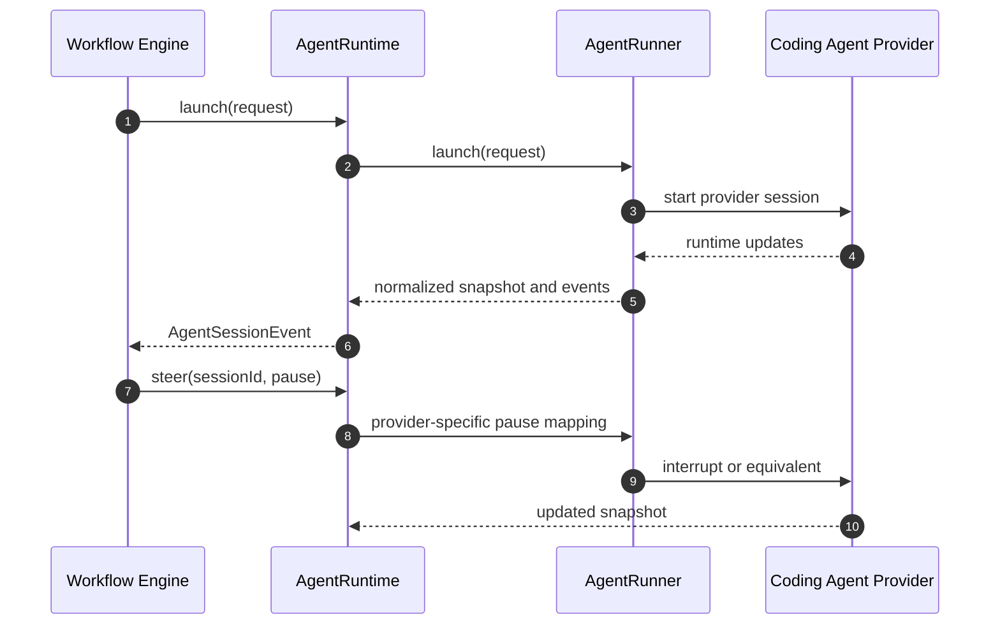

# Agent Runtime

This document defines the target provider-neutral agent execution contract for Mission.

This is a from-scratch specification.

It does not preserve compatibility with the current runtime split, current session-object layering, or current provider-specific boundaries.

The purpose of this document is to define the smallest clear contract between the workflow engine and agent execution before implementation begins.

## Relationship To Other Specifications

This document must be read alongside the workflow engine specification and the airport control plane specification.

Priority rule:

1. the workflow engine specification defines mission truth, workflow events, and reducer-emitted requests
2. the airport control plane specification defines Airport layout authority, Runway projection, focus policy, and substrate reconciliation
3. this runtime specification defines how Mission launches, steers, observes, and reconciles live agent sessions

If this document is interpreted to give runtime adapters ownership of workflow policy, Airport layout, Runway routing, or terminal pane topology as application truth, that interpretation is wrong.

## Design Decision

Mission standardizes on one workflow-facing runtime boundary: `AgentRuntime`.

The public runtime model has four concepts only:

1. `AgentRuntime`
2. `AgentRunner`
3. `AgentSessionSnapshot`
4. `AgentSessionEvent`

Everything else is internal implementation detail unless later experience proves otherwise.

That means these are not first-class architecture concepts:

- coordinator
- orchestrator
- terminal transport service
- event emitter service
- persistent session store service

Those may exist inside the implementation. They do not define the architecture.

## Goals

The runtime contract must be:

- provider-neutral
- workflow-engine-first
- explicit about launch context
- explicit about steering semantics
- explicit about progress and waiting state
- recoverable after daemon restart
- minimal enough to support thin provider adapters

## Non-Goals

This specification does not attempt to solve:

- dynamic discovery of provider-native slash commands
- provider-specific transcript formatting
- every possible provider callback surface
- Airport pane management as part of the runtime API
- exposing every helper object used internally by the runtime

## Core Boundary

The workflow engine talks only to `AgentRuntime`.

It does not talk directly to provider runners.

It does not talk to session objects.

It does not know about terminal transport helpers.

The flow is:



## Ownership Model

| Layer | Owns | Must not own |
| --- | --- | --- |
| Workflow engine | when work should start, be steered, stop, or recover; mission truth | provider protocol, terminal IO details |
| Agent runtime | live session registry, recovery, event observation, persistence, runner selection | workflow truth, Airport layout semantics |
| Agent runner | provider translation, provider process or SDK interaction | workflow policy, Runway routing |

## Structured Launch Context

The workflow engine needs a structured launch contract, not a prompt blob.

The minimum required launch context is:

- mission identity
- stage identity
- task identity
- task description
- execution instruction
- specification context
- working directory
- requested runner
- resume mode

The task and the specification must remain distinct.

The task tells the agent what bounded unit of work to perform.

The specification tells the agent what constraints and governing artifacts apply.

## Canonical Types

```ts
export type AgentRunnerId = string;
export type AgentSessionId = string;
export type AgentRuntimeErrorCode =
  | 'runner-not-available'
  | 'session-not-found'
  | 'prompt-not-accepted'
  | 'action-not-supported'
  | 'invalid-session-state'
  | 'launch-failed'
  | 'attach-failed';

export type AgentSessionStatus =
  | 'starting'
  | 'running'
  | 'paused'
  | 'awaiting-input'
  | 'completed'
  | 'failed'
  | 'cancelled'
  | 'terminated';

export type AgentProgressState =
  | 'unknown'
  | 'working'
  | 'paused'
  | 'waiting-input'
  | 'blocked'
  | 'done'
  | 'failed';

export type AgentAttentionState =
  | 'none'
  | 'autonomous'
  | 'awaiting-operator'
  | 'awaiting-system'
  | 'paused';

export type AgentSteerAction =
  | 'pause'
  | 'resume'
  | 'checkpoint'
  | 'nudge'
  | 'finish';
```

## Launch Request

```ts
export interface AgentTaskContext {
  taskId: string;
  stageId: string;
  title: string;
  description: string;
  instruction: string;
  acceptanceCriteria?: string[];
}

export interface AgentContextDocument {
  documentId: string;
  kind: 'spec' | 'brief' | 'artifact' | 'note';
  title: string;
  path?: string;
  summary?: string;
}

export interface AgentSpecificationContext {
  summary: string;
  documents: AgentContextDocument[];
}

export interface AgentLaunchRequest {
  missionId: string;
  workingDirectory: string;
  requestedRunnerId?: AgentRunnerId;
  task: AgentTaskContext;
  specification: AgentSpecificationContext;
  resume: {
    mode: 'new' | 'attach-or-create' | 'attach-only';
    previousSessionId?: AgentSessionId;
  };
  initialPrompt?: {
    source: 'engine' | 'operator' | 'system';
    text: string;
    title?: string;
  };
  metadata?: Record<string, string | number | boolean | null>;
}
```

`requestedRunnerId` is advisory only.

`AgentRuntime` owns runner resolution.

Rules:

1. `task.description` explains the work item in operator terms.
2. `task.instruction` is the execution-ready instruction the runner must present to the provider.
3. `specification.summary` is the required high-level governing context.
4. `specification.documents` carries selected spec and artifact references without turning the runtime into a document loader.
5. `initialPrompt` is optional bootstrap text, not a replacement for the structured launch contract.

## Snapshot Contract

```ts
export interface AgentProgressSnapshot {
  state: AgentProgressState;
  summary?: string;
  detail?: string;
  units?: {
    completed?: number;
    total?: number;
    unit?: string;
  };
  updatedAt: string;
}

export interface AgentSessionSnapshot {
  runnerId: AgentRunnerId;
  sessionId: AgentSessionId;
  missionId: string;
  taskId: string;
  stageId: string;
  status: AgentSessionStatus;
  attention: AgentAttentionState;
  progress: AgentProgressSnapshot;
  waitingForInput: boolean;
  acceptsPrompts: boolean;
  acceptedActions: AgentSteerAction[];
  workingDirectory: string;
  transport?: {
    kind: 'terminal';
    terminalSessionName: string;
    paneId?: string;
  };
  failureMessage?: string;
  startedAt: string;
  updatedAt: string;
  endedAt?: string;
}

export interface AgentRuntimeError extends Error {
  readonly code: AgentRuntimeErrorCode;
  readonly runnerId?: AgentRunnerId;
  readonly sessionId?: AgentSessionId;
}
```

Rules:

1. snapshots are the public representation of session state
2. public workflow code should not require a live session object to inspect state
3. `waitingForInput` is not the same thing as `paused`
4. `progress` must be truthful and may remain `unknown`
5. transport metadata is diagnostic and recovery data only, never workflow truth

## Event Contract

```ts
export type AgentSessionEvent =
  | { type: 'session.started'; snapshot: AgentSessionSnapshot }
  | { type: 'session.attached'; snapshot: AgentSessionSnapshot }
  | { type: 'session.updated'; snapshot: AgentSessionSnapshot }
  | { type: 'session.awaiting-input'; snapshot: AgentSessionSnapshot }
  | {
      type: 'session.message';
      channel: 'stdout' | 'stderr' | 'system' | 'agent';
      text: string;
      snapshot: AgentSessionSnapshot;
    }
  | { type: 'session.completed'; snapshot: AgentSessionSnapshot }
  | { type: 'session.failed'; reason: string; snapshot: AgentSessionSnapshot }
  | { type: 'session.cancelled'; reason?: string; snapshot: AgentSessionSnapshot }
  | { type: 'session.terminated'; reason?: string; snapshot: AgentSessionSnapshot };
```

The event model is intentionally small.

It models only what the workflow engine and operator surfaces need:

- lifecycle updates
- progress updates
- awaiting-input transitions
- auditable messages
- terminal outcomes

## Agent Runtime Interface

```ts
export interface AgentRuntime {
  launch(request: AgentLaunchRequest): Promise<AgentSessionSnapshot>;
  attach(reference: AgentSessionReference): Promise<AgentSessionSnapshot>;
  listSessions(filter?: { missionId?: string }): Promise<AgentSessionSnapshot[]>;
  getSession(sessionId: AgentSessionId): Promise<AgentSessionSnapshot | undefined>;

  prompt(
    sessionId: AgentSessionId,
    prompt: { source: 'engine' | 'operator' | 'system'; text: string; title?: string }
  ): Promise<AgentSessionSnapshot>;

  steer(
    sessionId: AgentSessionId,
    action: AgentSteerAction,
    options?: { reason?: string; metadata?: Record<string, string | number | boolean | null> }
  ): Promise<AgentSessionSnapshot>;

  cancel(sessionId: AgentSessionId, reason?: string): Promise<AgentSessionSnapshot>;
  terminate(sessionId: AgentSessionId, reason?: string): Promise<AgentSessionSnapshot>;

  observe(listener: (event: AgentSessionEvent) => void): { dispose(): void };
}
```

This is the only workflow-facing runtime boundary.

Rules:

1. `attach(...)` never returns `undefined`
2. if the target session no longer exists, `attach(...)` returns a terminal snapshot with status `terminated`
3. `prompt(...)`, `steer(...)`, `cancel(...)`, and `terminate(...)` reject with `AgentRuntimeError` when the operation is invalid or unsupported

## Agent Runner Interface

`AgentRunner` is a provider seam, not a workflow-facing orchestration boundary.

```ts
export interface AgentSessionReference {
  runnerId: AgentRunnerId;
  sessionId: AgentSessionId;
  transport?: {
    kind: 'terminal';
    terminalSessionName: string;
    paneId?: string;
  };
}

export interface AgentRunner {
  readonly id: AgentRunnerId;
  readonly displayName: string;

  checkAvailability(): Promise<{ available: boolean; detail?: string }>;
  observe(listener: (event: AgentSessionEvent) => void): { dispose(): void };
  launch(request: AgentLaunchRequest): Promise<AgentSessionSnapshot>;
  attach(reference: AgentSessionReference): Promise<AgentSessionSnapshot>;
  list?(): Promise<AgentSessionSnapshot[]>;

  prompt(
    sessionId: AgentSessionId,
    prompt: { source: 'engine' | 'operator' | 'system'; text: string; title?: string }
  ): Promise<AgentSessionSnapshot>;

  steer(
    sessionId: AgentSessionId,
    action: AgentSteerAction,
    options?: { reason?: string; metadata?: Record<string, string | number | boolean | null> }
  ): Promise<AgentSessionSnapshot>;

  cancel(sessionId: AgentSessionId, reason?: string): Promise<AgentSessionSnapshot>;
  terminate(sessionId: AgentSessionId, reason?: string): Promise<AgentSessionSnapshot>;
}
```

Thin CLI-specific implementations should hide terminal management internally.

Mission should not require a public `TerminalTransport` interface in order to define the architecture.

Rules:

1. `AgentRunner.observe(...)` is the provider-facing event source that allows `AgentRuntime` to construct the authoritative runtime observation stream
2. `AgentRunner.attach(...)` never returns `undefined`; missing sessions normalize to terminal snapshots
3. `AgentRunner` must reject invalid prompt or steer operations with typed runtime errors rather than silently ignoring them

## Internal Implementation Guidance

A lean implementation may still use internal helpers such as:

- an in-memory session registry
- an event emitter
- a persistent session store
- a terminal transport helper
- an abstract terminal-backed runner base class

Those are implementation choices.

They are not public architecture and should remain internal until a concrete cross-runner contract proves necessary.

## Fresh-System Rule

The new system should be implemented top-down from this contract.

Do not derive the public model from existing runtime plumbing.

Do not preserve intermediate boundary objects just because the current code has them.

The public question is only:

- what does the workflow engine need to launch, steer, observe, and recover agent sessions safely

If a public type does not serve that boundary directly, it does not belong in the architecture.

## Invariants

1. the workflow engine talks only to `AgentRuntime` for live session work
2. runners translate provider behavior; they do not define workflow policy
3. the runtime owns recovery and session registry behavior
4. snapshots and events are the public representation of session state
5. transport details are never workflow truth
6. provider-specific commands are never the core contract

## Initial Implementation Scope

The first implementation pass should deliver:

1. one `AgentRuntime` interface and implementation
2. one `AgentRunner` interface
3. one snapshot and event contract
4. one thin CLI-backed runner implementation
5. workflow request executor integration through `AgentRuntime` only

The first pass does not need:

1. multiple exported orchestration layers
2. public transport abstractions
3. public persistence abstractions
4. public event-emitter abstractions

## Decision

Mission should define a fresh agentic system around one public runtime boundary.

The public model is:

- `AgentRuntime`
- `AgentRunner`
- `AgentSessionSnapshot`
- `AgentSessionEvent`

Everything else is implementation detail unless proven otherwise by real cross-provider needs.
